## 四旋翼飞行器结构和运动原理

**一、四旋翼的概述：** 四旋翼飞行器，通常结构中心对称，机臂对称放置于四角，末端安装电机，机架中心安 放控制设备。结构形式如下图所示。为了提升飞行效率，四旋翼飞行器也可以非对称结 构设计。虽然结构对称，但仍有机头和机尾方向。

> 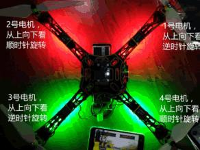{width="3.0411111111111113in" height="2.28125in"}

**二、四旋翼的工作原理：** 飞行器通过调控四个电机，就能改变飞行器的飞行姿态和位置。千万不要想当然认为桨 叶向下吹风就可以平稳起飞，为了保持平衡，必须是 2 只电机正转，另 2 只电机反转， 如下图所示：1 号电机和 3 号电机逆时针旋转，2 号电机和 4 号电机顺时针旋转。

> {width="2.9054385389326334in" height="2.7604166666666665in"}

飞行器通过调控 4 个电机，便可实现升降，俯仰，左右横滚，前后翻滚，改变航向等各 种飞行动作。当升力刚好等于飞行器自重时，飞行器处于悬停状态。

> **三、四旋翼的几个组成部分：** 1、机架：
>
> 有 X 型、十字型，H 型等结构，大小有 250mm、330mm、380mm、450mm、500mm 等，尺 寸是两个对角线电机的中心间距，如下图所示：
>
> 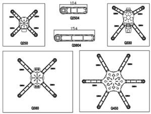{width="3.124448818897638in" height="2.3645833333333335in"}

2、电机： 电机分为有刷电机和无刷电机两种，有刷电机也叫直流电机，采用电压调速法，调速 结构简单；无刷电机也叫交流电机，采用变频调速法，调速结构复杂；无刷电机的优 点是：寿命长，功率大，效率高。相同体积重量的电机，无刷电机功率更大，可提供 更强飞行动力。

> 四旋翼基本都选用无刷电机，内有 3 组线圈，依靠电子调速器变频调速。只有结构简 单的微型四旋翼（玩具型四旋翼），才选用有刷电机。
>
> 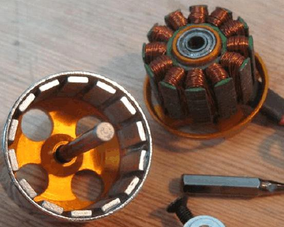{width="2.373682195975503in" height="2.0258333333333334in"} 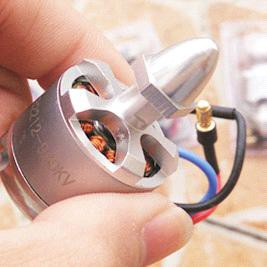{width="2.0581244531933507in" height="2.0581244531933507in"}

认识电机标示及 KV 值的意义： 上图的电机标识为：B2212，就是直径 22 毫米，高度 12 毫米。

电机标识的 KV 值，低的有 3-5 百，高的有 3-5 千，表示电压每升高 1V，电机增加的转 数值。

一般相对而言：

KV 值低的电机，绕线细，匝数多，转速慢，扭力大，载重大，适合配大桨。 KV 值高的电机，绕线粗，匝数少，转速快，扭力小，载重小，适合配小桨。

3、电子调速器： 电子调速器简称电调，一端连接飞控，接收调速信号；另一端连接电机，驱动电机转 动。由于没有电刷，电机不但使用寿命长,功率大，而且不产生电火花，这将大幅降 低系统的电磁干扰。无刷电机有 3 根线，所以电调输出也是 3 根线。 注意：电调的性能优劣，决定了整个系统的反映速度，优质的电调响应速度快，飞行 更加平稳，不晃动，易于操控，而且驱动能力强大，不易烧坏。

> 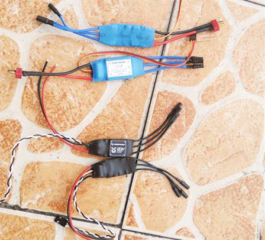{width="2.8944827209098865in" height="2.452916666666667in"}

4、桨叶： 有高速桨和慢速桨。

> 图中所示：电子调速器

慢速桨，根部细，外侧面大，主要利用外侧面产生升力，高速旋转时，桨根易断裂。 高速桨,内侧面宽，外侧面窄,主要利用内侧面产生升力，旋转时阻力小，不易断裂。

桨叶的直径和螺距： 直径是指桨叶转动时的圆周直径，螺距是指桨面与电机轴线的夹角。

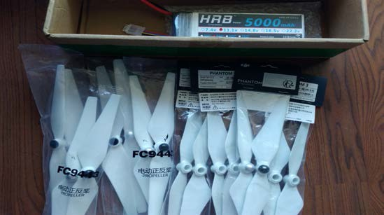比如：标识 9450 的桨叶，就是转动圆周直径 9.4 英寸，叶片螺距 50 度。其它型号标 识的意义相同，标识的是直径和螺距。

图中是大疆 9450 高速桨叶

选配桨叶参考： 桨叶与空气的作用力，除了产生垂直向上的推力外，还产生横向的水平推力，使空气 旋转。一般希望横向推力越小越好。桨叶螺距越大，横向推力越大，力效越低。 四旋翼采用 2 只电机正转，2 只电机反转，以相互抵消横向推力。 飞机改变航向，要用到横向推力。

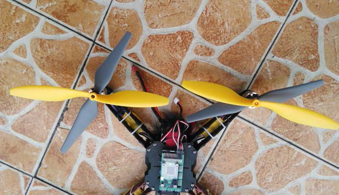选配桨叶，要根据四旋翼的载重，电机的性能指标，选配合适的桨叶，达到最佳效率。 选配的桨叶面积越大，推力越强，四旋翼为了维持飞行平衡，就自动降低电机转速， 电机转速越低，电流越大，发热多，能耗高。所以，用同样一块电池，采用大面积桨 叶，飞行时间会短一些。提醒一下:选用细长的桨叶，效率会更高。 一般低速电机配大浆，高速电机配小浆。载重量大配大桨，载重量小配小桨。

> 图中，你能辨认出哪只是高速桨，哪只是低速桨吗？

总结：

1）、KV 值大的电机，转速高，选配小尺寸螺旋桨。反之，KV 值小的电机，转速低， 要选配大尺寸桨叶。

2）、如果选配大尺寸桨叶，为了维持平衡，系统会自主调控，降低电机转速。如果选

> 配小尺寸桨叶，系统会自主调控，提高电机转速。电机只有工作在额定转速时，才 具有最佳能效。

3）、桨叶配备偏大，电机转速偏低，能耗过大，电机发热量大，造成电机退磁，性能 下降。相反，桨叶配备偏小，电机转速过快，桨叶噪音大，升力不足，也不能发挥 最佳效率。好比行驶的轿车，只有 80 公里时速时，最节省燃油一样。

下面是电机与桨叶搭配表，仅供参考： 采用三节锂电池串联的电池组（3S），电池组电压 11.1V； KV900-1000 的电机配 1060 或 1047 浆，9 寸浆也可以。 KV1200-1400 配 9050（9 寸浆）至 8\*6 浆

> KV1600-1800 左右的 7 寸至 6 寸浆 KV2200-2800 左右的 5 寸浆 KV3000-3500 左右的 4530 浆

采用两节锂电池串联的电池组（2S），电池组电压 7.4V；

KV1300-1500 左右用 9050 浆 KV1800 左右用 7060 浆 KV2500-3000 左右用 5X3 浆 KV3200-4000 左右用 4530 浆

5、电池

电池有 4 个重要参数：串联节数，容量，放电倍率，充电倍率。

2S 表示电池是两节串联，单节电压 3.7V-4.2V,串联后电压是 7.4V-8.4V

3S 表示电池是三节串联，单节电压 3.7V-4.2V,串联后电压是 11.1V-12.6V

电池容量，如标注 5400MAH 电池，表示以 5400MA 电流放电，能提供 1 小时电能。

放电倍率 C,是指电池的放电能力，最大电流是：容量与放电倍率 C 的乘积，如 5400MAH,30C 的电池，最大短路电流是：5.4X30=162A（安培）。 四旋翼采用无刷电机，功率很大，工作电流大，可达到 10 几安培，所以航模电池 放电倍率大的电池组，一般是 20C，30C，40C，普通手机等锂电池放电倍率低，不 适用于四旋翼飞机。

> 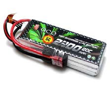{width="1.4878641732283464in" height="1.1866666666666668in"}

充电倍率 C：是电池的充电能力，一般是 5C，如标识为 5400MAH，5C 电池，允许最 大充电电流是 5.4X5=27A（安培）；

注意：

电池不能过放电，单节电压不能低于 3.7V，过放电，电池鼓起损坏。电池也不能过 充电，单节充电到 4.15V-4.20V 之间合适，过充电，电池也鼓起损坏。 长期储存，单节电压在 3.85V，3 节电压在 11.55V 适合期存放。

补充说明：

1）、飞行时要加装 BB 响（欠压告警器），设置好欠压时告警值。3S 电池组欠压告 警值为 11.1V。

2）、还可以加装电压计，实时检测电池电压，并在遥控器屏幕上，显示电压值，

> 连线方法，查看图片文件夹，或查看遥控器资料，有更详细讲解。

6、飞控：

> 无人机的飞行控制系统简称：飞控。 飞控是无人机的核心部件，硬件主要有微控制器（CPU）、气压计、陀螺仪、加速 度计、磁力计等传感器、以及输入输出控制电路组成。 随着科技进步，目前各种微处理器性能都非常强大，片内资源丰富，型号种类齐全， 并且价格十分低廉，STM32F407 微处理器用于控制四旋翼无人机，芯内资源充裕， 非常轻松。所以，仅仅看飞控的硬件，已经不能反映飞控的性能优劣。
>
> 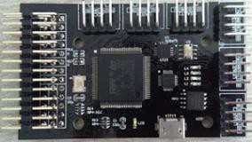软件才是飞控的核心，衡量飞控的性能优劣，主要是看软件算法，程序架构，编程 思想。利用传感器数值，建立数学模型，解算飞行姿态，卡尔曼软件滤波，消除电 磁干扰。接收遥控指令，编解码收发数据。快速驱动电机，控制四旋翼的飞行姿态， 这才是飞控的核心内容。
>
> LIGHT 飞控图片

LIGHT 飞控的主要性能： 1）、微控制器（CPU）是飞控核心芯片，接收并处理遥控指令和传感器输入信号，经过

快速复杂的运算，实现对飞机的姿态调控。 2）、加速度计，用于检测三轴方向的加速度，计算并控制飞行姿态。

3）、陀螺仪，用于检测三轴方向的角速度，计算并控制飞行姿态。

4）、磁力计也叫电子罗盘，通过检测地球磁场，判断地理南北方向。

5）、气压计，用于检测大气压，计算飞行高度。

6）、蓝牙模块，收发控制指令，用于手机遥控飞机。

7）、GPS 模块，用于确定地理坐标，实现航向规划，定点返航。

8）、超声波模块，用于测试飞行高度，避障。

9）、数传模块，无线串口数据远传，实现远程操控飞机。

10）、飞控连接电调，将调速信号交给电调，电调驱动电机转动，实现电机调速。

11）、与航模遥器配合，实现远程遥控。

7、遥控器与接收机： 遥控器有很多种类，按着使用习惯，分为左手油门和右手油门，我们用左手油门，也称 美国手遥控器。按着数据传输方式，分为数字遥控器和模拟遥控器。模拟遥控器一般， 结构复杂，功能简单，传输距离远，能耗大，价格偏高，我们用数字遥控器。

下图所示，富斯 FS-i6 遥控器与接收机，采用双频设计，数据能发能收，采用数字传输 方式，价格合理，功能强大，是一款性价比非常不错的航模遥控器。

> 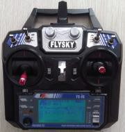{width="1.8775426509186353in" height="1.9791666666666667in"} 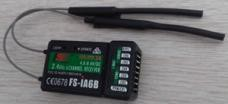{width="2.3713517060367453in" height="1.0833333333333333in"}

图为：富斯 Fs-i6 遥控器及 Fs-iA6B 接收机

> 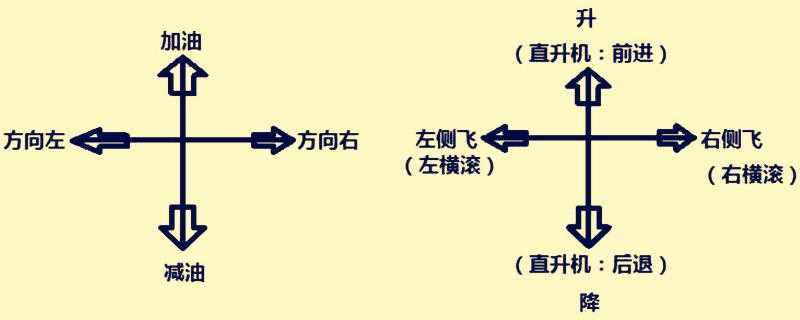{width="4.6659678477690285in" height="1.8666655730533683in"}

左手摇杆：前后摇动，控制飞机升降，左右摇动，控制飞行航向， 右手摇杆：前后摇动，控制前后平移，左右摇动，控制左右平移。 注：对四旋翼飞机而言，油门就是升降控制，加油就是升高，减油就是降落。

遥控接收机：

富斯 FS-iA6B 接收机有 4 个主通道，2 个辅通道。

主通道 1 是 ROLL，控制飞机横滚(左右)，固定翼是控制副翼 主通道 2 是 PIT，控制飞机俯仰（前后），固定翼是控制升降舵 主通道 3 是 THR，控制飞机油门（升降），固定翼是控制油门 主通道 4 是 YAW，控制飞机航向（转向），固定翼是控制方向舵

2 个辅通道，其中每个辅通道又分成低、中、高三个档位。辅通道可以灵活设定，映射 到遥控器的不同开关或旋钮上，或开关旋钮的不同档位上，方便使用。如定点定高、悬 停、返航等功能。

四、**数传模块：** 飞控配件的蓝牙模块，用于飞控与地面站的无线连接，为调试、校准带来极大方便，但 有效距离仅 10 米，不能用于控制飞行。而数传是用于远程无线数据传输。

飞控利用数传模块，将数据发送到地面，地面数传接收数据在电脑（Windows 地面站） 或者手机（安卓地面站）显示数据，并实现电脑或者手机远距离遥控飞机。

数传模块就是无线串口收发装置，必须成对使用，采用无线电技术，双向传输数据，无 人机上一只小板，地面站一只，可大可小。就是：可采用一大一小配对，也可采用两只 小板配对。区别是，大板带蓝牙功能，用于地面站，可连手机、电脑，可同时收发数据。 小数传板用于地面站，只能连接电脑。

LIGHT 数传模块，有效传输距离大约 1-2km，比航模遥控器的传输距离远一些。

> 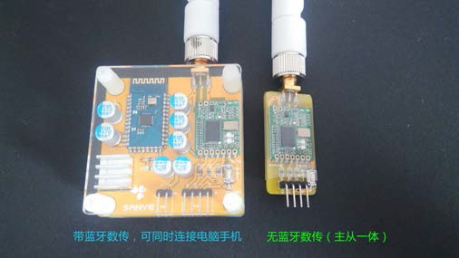{width="3.3772200349956254in" height="1.9in"} 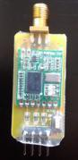{width="0.9031310148731408in" height="1.8645833333333333in"}
>
> 地面数传(大板）带蓝牙 数传小板
>
> 模块配对： 数传模块可以灵活配对，既可以大板与小板配对，也可以小板与小板配对。 1）、用**手机**遥控飞机时，采用大板与小板配对。要有电源为大板供电，大板上有 5V
>
> 稳压电源，用 2 节或 3 节锂电池都可以。 2）、用**电脑**遥控飞机时，采用小板与小板配对，小板用线（USB 转 TTL）与电脑 USB
>
> 口连接，不需要外加电源，USB 口供电。当然，也可以用大板与小板配对，如果大 板用线（USB 转 TTL）连到电脑 USB 口上，也不需要外加电源。
>
> 数传模块配置（详见"**模块资料：SANYE 数传资料**"，这里只是概述）： 1）、传输波特率设置为 38400，大板蓝牙设置，请看光盘，蓝牙设置部分。

2）、LIGHT 数传模块，可灵活配置传输频段，波特率，传输带宽，发射功率等，要根

> 据当地环境，合理配置参数，可增加传输距离。选用好的传输频段，可增加传输距 离。更详细的说明，请看光盘，数传模块部分。

#### 注意：传输频段，要设置为 433M，这是无线电爱好者频段，要遵守国家法规，避免干扰

> **其他通讯设备。**
>
> {width="2.7588123359580052in" height="1.9375in"}
>
> **五、手机遥控无人机**

安卓手机地面站提供 2 个版本：LightPlannerV4.apk, 和 LightPlannerV7.apk。V4 版 软件，可用于安卓 5.0 以下版本手机；V7 版软件，可用于安卓 6.0 以上版本手机。

手机内部有加速度计、陀螺仪、磁力计等传感器，可以感受运动方向、感受重力方向、 感受地磁场方向。还有 GPS 卫星定位功能，蓝牙无线传输，WIFI 互联网等，功能强大， 用手机遥控无人机前景非常好。

> 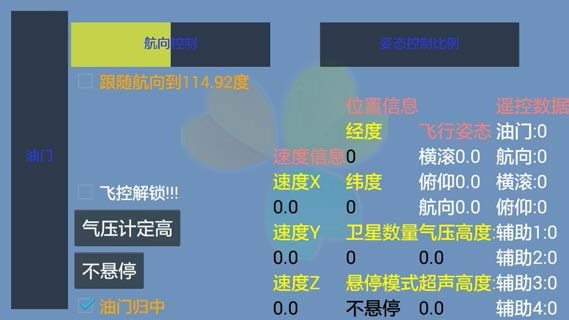{width="3.7916666666666665in" height="2.1333333333333333in"}

上图为手机安卓地面站控制界面，仅支持安卓手机，不支持苹果手机，将光盘里的手机 安装软件，用数据线发送到手机内，或加入 QQ 交流群，在群共享文件里下载，还可以 在商家网盘下载资料包。点击并完成安装，更详细安装方法，请参阅光盘资料。

1）、利用手机自带传感器，可以解算出手机自身的横滚和俯仰角度，并将数据发送给无人 机，无人机就能跟随手机的姿态变化，改变飞行姿态，实现手机遥控。并且能显示飞行 姿态、位置、高度等数据。 安卓地面站，利用手机蓝牙传输方式，将控制信号发送给无人机，软件界面友好，使用 简单，易于控制。可设置跟踪灵敏比例。

2）、航向跟踪功能：类似于无头模式，手机内有磁力计，利用手机的"指南针"功能，让 手机的指向与机头方向保持一致。控制飞机的飞行方向。这样做的好处是：手机的指向

就是飞机的航向，手机指向哪里，飞机就飞向哪里，特别适合超视距飞行，易于遥控飞 机，从而做到航向跟随。

4）、手机远程控制： LightPlanner(安卓地面站)软件，利用手机蓝牙功能，遥控飞机，由于蓝牙有效距离 仅 10 米左右，手机远程遥控，必须加数传模块，用数传模块，远距离无线传输数据， 实现手机远程遥控飞机。

#### 注意：没加装数传模块的飞机，不能超出蓝牙遥控范围（10 米内）使用，以免遥控失 灵，飞丢无人机。

> **六、电脑遥控无人机（Windows 地面站）：**

Light-Assistant(Windows 地面站)-1.0.7 地面站，该地面站是专为 LIGHT 飞控，开发的 控制软件，界面友好，操作简单，功能强大。光盘内有详细说明。

> 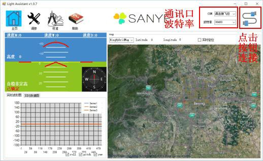{width="5.342393919510061in" height="3.2793744531933506in"}

# 飞控组装方法:

1、找到这 3 个包装带：

> 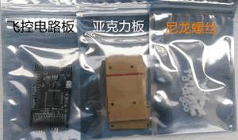{width="3.1257053805774277in" height="1.84375in"}

2、安装尼龙螺丝柱，上面，下面各安装 4 颗：

> 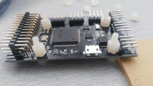{width="3.1257392825896764in" height="1.7604166666666667in"}

3、取出 1 大 1 小亚克力板，撕去亚克力板外层膜：

> {width="3.094481627296588in" height="1.7428116797900262in"}

4、飞控背面安装大块亚克力板

> 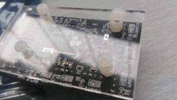{width="3.1257392825896764in" height="1.7604166666666667in"}

5、飞控正面安装小亚克力板，在气压计上面，加盖黑色海绵，安好上面的亚克力板后，海 绵就被压紧了，不要用胶粘，一旦胶水堵死气压计小孔，气压计就彻底失效了。

> 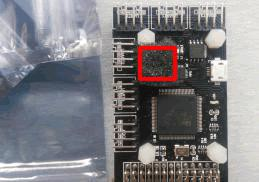{width="2.697146762904637in" height="1.8958333333333333in"}

#### 注意：气压计容易受风力、温度、光照的干扰，一定要加垫黑色海绵，以便减少干扰。 一旦阳光照射，高度测试不准，飞行忽高忽低。

6、紧固螺丝。完成组装，如下图所示。

> 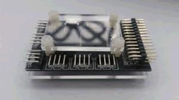{width="3.094481627296588in" height="1.7428116797900262in"}
>
> **四旋翼无人机的组装**

一、机架组装，电机电调的固定，如图所示： 在《安装图片文件夹》里有大图，看一下，就明白了，这里仅概述下。 提示：机架必须水平，牢固，不缺螺丝，不翘脚，否则导致偏飞。

> 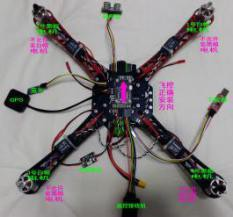{width="2.4254461942257217in" height="2.2604166666666665in"}

二、飞控固定： 机架上板有螺丝突起，可用热熔胶固定飞控，不仅平整，也易于拆卸。也可以用螺丝 固定到机架板上，只是拆卸麻烦点。注意飞控要放平，不要倾斜。方向正对机头方向， 不能横向安装。如果横向安装，起飞时，飞机翻身，无法起飞。 提示：飞控必须粘牢固，水平，不要倾斜，否则会导致偏飞。

> 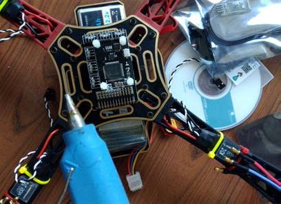{width="2.7253444881889766in" height="1.9733333333333334in"}
>
> 三、飞控外部设备连接： **警告：任何模块，任何线插好后，都要反复核对，确保正确后，方可上电，绝不允许**

#### 带点拔插，否则很容易损坏器件。

1、与电调连接：在组装图片文件夹里有大图。 注意：电调与飞控连接，插头必须一一对号入座，不能插错位置，否则翻跟头，无 法起飞。

> 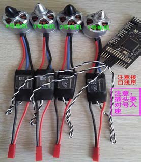{width="1.8491480752405949in" height="2.1199989063867015in"}

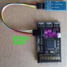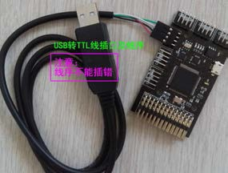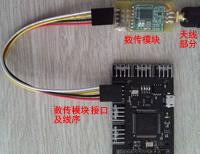2、与蓝牙模块连接：与 Usb 转 TTL 线连接：与数传模块连接： 蓝牙模块、Usb 转 TTL 线、数传模块，三者公用同一接口。 当用手机调试无人机时，这个接口插蓝牙模块。 当用电脑检测飞控板时，这个接口插 USB 转 TTL 线，传输数据。 当用手机远程遥控无人机时，这个接口插数传模块，实现远程遥控。 注意： 蓝牙模块的天线部位，要远离金属及遮挡物，否则传输距离变近。

超声波模块 USB 转 TTL 线 数传模块 3、与 GPS 连接：

注意：接口位置，插头线序，不能反插，反插烧毁 GPS 模块。

> 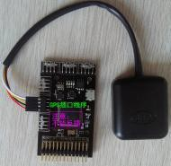{width="1.8318667979002625in" height="1.7921872265966754in"}

4、与超声波的连接： 注意：接口位置，插头线序，不能反插，否则烧毁超声波模块。

> 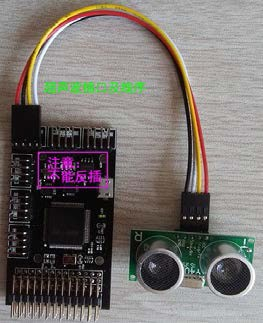{width="1.7604494750656168in" height="2.153332239720035in"}

5、与电源模块连接：

> 电源模块输入端连电池分线板，输出 5V，连接到飞控板上的 5V 网络，给飞控供电。 注意：插到飞控板上任何 5V 网络都可以，但插头坚决不能反插，否则烧毁飞控。
>
> 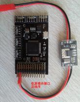{width="1.7159722222222222in" height="2.1666666666666665in"}

6、与下载器的连接： 用于下载程序，注意：接口及线序，不能反插。插反了烧接口。

> 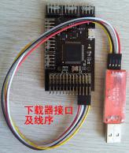{width="1.7076290463692039in" height="2.0208333333333335in"}

7、遥控接收机的连接：文件夹里有大图。

飞控与接收机之间，需要 6 颗信号线，2 颗电源线。共 8 颗线，线序如图中所示。 注意：线序不能接错，特别是电源线不能接错。

> 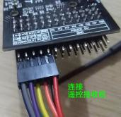{width="1.7842989938757656in" height="1.7291666666666667in"} 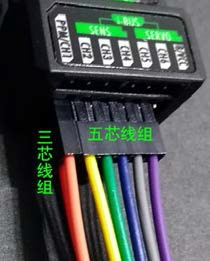{width="1.4023622047244095in" height="1.7399989063867016in"}

飞控板与接收机的线序连接：

> 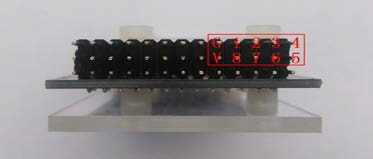{width="2.4856364829396327in" height="1.0599989063867017in"} 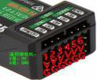{width="1.2821741032370955in" height="1.0520833333333333in"}

提示： 接收机其余端子不用连接。 8、电机和灯带连线：

电机工作电流大，电机连线要选用粗线，灯带连线选用细线。

> 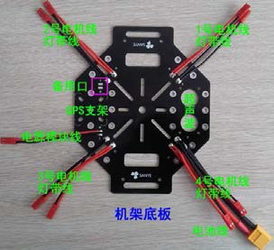{width="1.9969630358705162in" height="1.8178116797900263in"}
>
> 9、电池绑带固定： 用魔术带捆绑电池，如下图所示，中间黄色是魔术带。
>
> 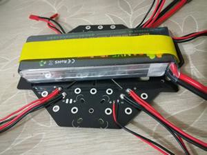{width="3.094300087489064in" height="2.3203116797900263in"}

一、调试前：

#  整机调试及校准

飞控与蓝牙模块接插方法，前面章节已经描述，本章重点讲解用蓝牙模块联机，调试校 准整机系统。

在使用之前，必须配置好蓝牙模块的参数，配置波特率为 38400，其它参数用默认值即 可。发货前，商家已经配置好了。关于蓝牙模块配置方法，请查阅《模块资料：蓝牙模 块资料》部分，这里暂不描述。

#### 提示：

也可以用 USB 转 TTL 线，与电脑联机，来调试和校准飞机，效果相同。电脑预先要安装 好 Windows 地面站，如果电脑系统是 win10，USB 转 TTL 线的驱动程序安装，可能会遇 到困难，在后面章节，详细讲述驱动安装方法，地面站安装，这里不描述。

> {width="2.7588123359580052in" height="1.9375in"}

1、手机软件安装：

将光盘里的安装文件 android5.0.apk，发送到手机，或者加入 QQ 技术交流群，在群共 享文件里下载，有了安装文件，点击并完成安装。 提示：为适用于不同版本的安卓手机，提供了 2 个安装版软件，android5.0.apk 和 android7.0.apk 版，内容相同。

2、手机与飞控联机： 在系统上电前，要仔细检查所有连线，请查看《安装图片文件夹》，与图片反复比对， 另外不能带电拔插，绝不可以插反，插反烧件，不能抱有侥幸心理，凭经验自认为是。。。 应该是这样。。。等等，很多初学者，急切想看看结果，反插连线，造成损失，回头再去 查看使用说明，实在是不应该。要检查所有连线正确无误后，方可系统上电。

3、飞机上电后，蓝牙模块红灯闪烁，立刻进入工作状态，此时用手机搜索蓝牙设备，稍 等片刻，手机就能搜到蓝牙设备，点击这个蓝牙设备，输入配对码"1234"。配对完毕 后，手机就能与飞控联机了。 如果始终搜不到蓝牙模块，检查飞控的电源供电，是否供电不足，单独的一块飞控板子， 需要用手机充电宝及充电线，插到 USB 口上，为飞控供电。

注意：如果手机是 6.0 以上安卓系统，请安装 android7.0.apk 版，否则容易出现闪退。 采用低版本安卓手机兼容性好。

> 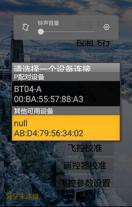{width="1.9526279527559056in" height="2.4796872265966754in"} {width="1.7156321084864392in" height="2.486665573053368in"}

点击连接飞控，稍等片刻，提示联机成功后，点击控制飞行，窗口显示姿态数据，晃动

飞机，数据有所变化，表示联机成功有效。如果姿态数据都是 0，晃动飞机，数据无变 化，就意味着联机失败。

常见问题原因如下：

1）、蓝牙模块波特率设置错误，正确值是 38400。手机无需设置波特率。

2）、如果用电脑蓝牙联机，电脑的蓝牙设备，波特率也是 38400。如果用 USB 转 TTL 线 联机，波特率也要设置成 38400，电脑对应的 COM 口要正确。 注意：数据格式，停止位 1、无奇偶校验。

二、传感器校准： 飞控有陀螺仪、加速度计、磁力计、气压计等传感器。由于材料和制作工艺等原因，每 只传感器都有差别，必须校准后才能使用，校准就是为了得到静态值。测量值与静态值 的差，才是我们想要的准确数值。 建议：每隔一段时间，都要校准一次，校准后有问题一定要重新校准。

> {width="2.3269160104986875in" height="3.3593744531933507in"}

1、陀螺仪、加速度计校准： 必须要将飞机放置在水平面位置，保持静止不动，点击校准加速度计和陀螺仪，1 秒 钟后，校准就自动完成了。此时也一并完成了气压计校准。

#### 提示：

> 校准后的陀螺仪大约是 X:0，Y:0，Z:0，加速度计大约是 Z:0，Y:0，Z:4095，或在此 附近的值，才算正常。

注意： 1）必须放置于水平面。倾斜状态下校准，起飞后，可能飞向某个方向。出现偏飞现象。

2）有人为了防摔，在 4 个电机下的机架处，绑上 4 块减震泡沫或海绵，这是可以的， 但必须校准完之后，再绑上减震材料。否则就会出现偏飞。

3）飞控下面，也不要加减震材料，这会导致飞控不水平，反应滞后，也会出现偏飞。

2、磁力计校准： 注意：绝不允许强磁铁靠近磁力计，这会损坏磁力计，导致飞行异常，甚至失控。

> 首次飞行或者更换飞行场地，都要校准磁力计。要远离磁铁和电器设备，选择没有铁 磁物体的开阔地带。也要远离电脑校准，电脑有干扰磁场。
>
> 点击：校准磁力计，蓝绿指示灯开始闪烁，就进入到磁力计校准模式，整个校准时间 大约 30 秒钟，在此期间，机架要在水平状态下转动 1\--3 圈；前后垂直状态下转动 1-3
>
> 圈；左右垂直状态下转动 1-3 圈。而后任意姿态放置，等到指示灯恢复原态，校准就 完成了。
>
> 如下图所示：
>
> 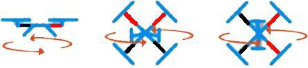{width="5.982457349081365in" height="1.423124453193351in"}
>
> 水平转 1-3 圈 前后垂直转 1-3 圈 左右垂直转 1-3 圈
>
> 磁力计是 3 轴空间方向传感器，要每个轴向各转动 1-3 圈，找到每个轴向静态值，测 量值与静态值的差，就是方向角，转动完成后，任意姿态放置，等待此模式结束。 提示：磁力计必须校准，才能使用。

3、电调校准：

> 电调校准目的是：保证电调对电机的驱动特性一致，4 个电调同时校准。

#### 注意：不同厂家的电调不要混用，不同型号的电机也不要混用，因为特性曲线可能不 一致，难以操控飞机。全新同批次电调，不用校准。

> 电调校准之前，要取下所有桨叶，以免意外伤人。**电调只有在上电瞬间，才能进入到 校准模式。**

1）、拔下电源模块，用外电源，先给飞控上电，电调不上电。可用手机充电宝和 USB 线， 连到飞控 USB 口上，让飞控先有电。其它没电。注意：在用 USB 给飞控上电前，一 定要先拔下电源模块的插头，否则，可能导致飞控板烧坏。

2）、要确保每个电调电源线（红黑粗线）与机架分电板连接好，并且电调信号线与飞控 连接好。电调信号线是细长线，白黑线，或白红黑线。

3）、手机与飞控联机。联机成功后，点击：电调校准:最大控制量。

4）、再插上电池，给 4 个电调上电，此时，**电机**发出滴... 滴... 校准音（注释：不同电 调声音不同，笔者用的电调是滴... 滴... 音），而后，在 2 秒内，立即点击电调校 准:最小控制量，电机发出另一种滴... 滴... 校准音，电调就这样校准完成了。如 果对校准音不确定，详见随机带的电调说明书。

> 下图是手机电调校准界面：
>
> 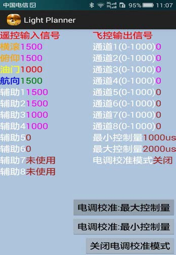{width="2.315in" height="3.3599989063867017in"}
>
> 整个校准过程，大约 3 秒钟，而后，电调进入工作状态，电调内部有微处理器，程序 代码控制电机旋转。

4、遥控器参量显示： 在手机的控制界面，点击控制飞行按钮后，窗体显示遥控器每个通道的参数值，和飞 控的输出值，手机仅显示遥控器参量，不能修改遥控器参数，航模遥控器功能十分强 大，可以设置油门推杆滑动曲线，非线性改变油门数值，满足不同人的使用习惯。

注意：遥控器的控制优先级高于手机。就是说：在使用遥控器控制飞机的情况下，手机不 能控制飞行，只能显示遥控器参量。只有拔下遥控接收机，手机才能控制飞行。但 手机解锁，修改参数不受遥控器影响。

> {width="1.7288713910761155in" height="1.8208333333333333in"} {width="2.156823053368329in" height="0.9858333333333333in"}
>
> FS-I6 遥控器 IA6B 双频接收机
>
> 富斯 FS-i6 遥控器，该型号遥控器，共开放 6 个通道，其中 4 个主通道、2 个辅通道， 每个通道，都可以根据使用习惯，映射到不同的推杆或按钮上。就是说，既可以配置 成左手油门，也可以配置成右手油门。每只开关按钮，都可以自由定义功能。 使用双频设计，双向传输数据，接收机可选连接电压计，在遥控器液晶屏上，随时观 测飞机上电池电压，防止电池过放电。

提示： 1）、遥控器油门，可随意设置油门曲线，易于操控，防止油门大起大落，满足个性使用

习惯，请参阅《模块资料：遥控器资料》。

2）、关于遥控器设置，要查看遥控器光盘，或者在《模块资料：遥控器资料》找到配置 教程。

3）、遥控器有美国手（也叫左手油门），日本手（也叫右手油门），还有中国手，欧洲手 等，就是油门、航向、横滚、俯仰等动作，不同类型的遥控器，使用摇杆或者摇杆 方向可能不同。我们用左手油门。

4）、注意，每一个通道都是，当有遥控器控制时，飞控采用遥控器信号，不采用手机信 号。只有这个通道没有遥控器控制时，才可用手机控制（手机或电脑控制的优先级 低于遥控器控制）。简单说：就是拔掉这个通道的信号线（接收机与飞控连线），才 能接受手机或电脑控制。遥控器控制优先级高于手机或电脑控制。

5）、在飞行中，遥控器千万不要关机，否则接收机进入保护模式。在保护模式下，接收 机向飞控发送预先设置的控制参数（遥控器说明书有详细描述预设方法）。这是危 险动作，飞机会失去控制，详见遥控器关盘资料。

> 注意：保护模式下，6 个通道都有预设信号，接收机仍然向飞控发送信号，此时飞 控不接受手机遥控信号，（手机优先级低）飞控无法判断遥控器是否关机。

6）、一定要确保遥控器电池满电，当电量不足时，遥控距离会缩短，飞行不稳，飞机 晃动，甚至摔机哦。遥控器用 3 节 5 号碱性电池。

5、恢复飞行参数： 飞控程序里有默认飞行参数，通俗一点讲，就是：恢复出厂设置。更换新程序后，一定 要恢复默认参数，只有恢复后，飞行才更加稳定。因为每套程序，参数都略有不同。 下图是手机和电脑恢复默认参数。

> 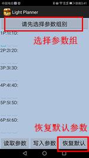{width="1.6549300087489063in" height="2.9370833333333333in"} 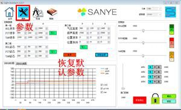{width="3.124316491688539in" height="1.90625in"}

注释： 通常,用默认参数就能满足要求，参数是从片外存储器读取。如果开发新机型，可现场 用手机或笔记本电脑，任意修改参数，直到满意为止，这样就得到一组新参数，再将新 参数放到源代码里，并烧录到飞控的 STM32 内，等再次恢复默认参数时，显示出来的就 是新参数了，这样设计的好处是，方便开发新机型，为调参带来方便。

提示：关于每个参数的意义，在后面章节里，有专门讲解，这里不做详述。 三、初次试飞：

遥控飞机，可采用遥控器控制、手机控制和电脑控制，三种控制方式。

1）、手机控制方式（安卓：LightPlanner）：操控简单，灵活方便，屏幕上所有功能一 目了然，容易上手，不需要过多培训，晃动手机，飞机就跟随手机，改变飞行姿态。 建议：

> 初学者，先用遥控器控制，熟练后，再用手机控制，防止摔机。 手机或电脑远距离遥控，需要加数传模块。

2）、遥控器控制方式：遥控器功能强大，控制精度高。适合飞行表演，穿越飞行，是最 常用的飞行方式。遥控器可以预先设置油门曲线，提升操作手感。

3）、电脑控制方式（Windows：LightAssistant）：屏幕上所有功能一目了然，容易上手， 方便实时对飞行器参数调整，与手机控制完全一致。远距离要加数传模块，借助 GPS 卫星定位系统，实行查看位置信息。

1、用蓝牙模块，目的是为了方便调试、校准，没有连线缠绕，蓝牙遥控距离仅 10 米，遥 控距离很近，如果用手机或电脑远距离遥控飞机，必须加装数传模块，否则超出蓝牙控 制范围，飞机会失控，甚至飞丢。

无线数传模块传输距离 1-2 公里，比遥控器传输距离更远，一般遥控器是 1km 之内。数 传模块如果配置得当，传输距离可达到 3km，关于数传模块的配置方法，请参阅《模块 资料：数传模块资料》部分，这里不做详述。

建议：新手一定要用遥控器控制飞机，等熟练之后，再试着选择用手机遥控。

注意：要选择在空旷场地进行试飞，切勿在人多的地 方试飞，以免伤人，为避免摔坏 飞机，建议选在草坪地试飞。

下图所示：手机控制界面

> 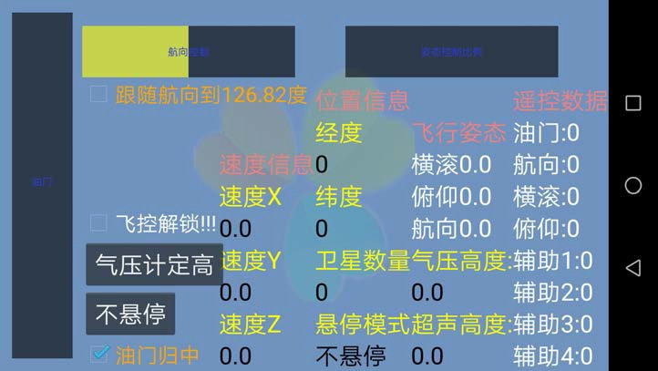{width="4.822218941382327in" height="2.7133333333333334in"}

2、飞控解锁： 可以用手机解锁、遥控器解锁、电脑解锁。

飞控上电后，出于安全考虑，默认是锁定状态。锁定时，推遥控器油门，所有电机不转， 只有解锁后，才能转动飞行。 1）、手机解锁与加锁：在手机界面上，点击飞控解锁、点击飞控加锁。

2）、遥控器解锁与加锁：将油门杆推到**右下角**，保持 2 秒钟，指示灯由呼吸状态，转成

> 常亮，飞控解锁成功。将油门杆推到**左下角**，保持 2 秒钟，指示灯进入呼吸态，飞 控加锁成功。

3）、电脑解锁与加锁，参考 windows 地面站软件，暂不叙述。 提示： 1）、飞控上电，处于锁定状态，只有解锁后，才能遥控电机转动。

2）、油门处在最低状态，飞控长时间没收到遥控信号，自动加锁。

3）、用遥控器控制飞行的时候，不能用手机或电脑加锁，这可能会导致坠机。

3、遥控电机转动：

1）、不安装桨叶遥控飞机时，因飞控要努力调整姿态，控制电机转动，此时 4 个电机转 速差别很大，尤其是相邻电机，一个可能达到最大转速，另一个还不怎么转动，这 并非质量问题，要注意安全，减小油门，防止电机过速。

2）、安好桨叶，遥控飞行，缓慢推动油门，让飞机慢慢离地，保持平衡，因为控制有滞 后（不是推油门立刻就飞起来），油门不要过大，初次试飞，飞行不要过高，免得 摔坏飞机。

> 提示：**如果电机装错位置，会导致起飞就翻跟头或极速自旋**，根本不能起飞。检查电机 位置是否正确，前文已经描述过。 如果是偏飞，请查阅后面章节，《疑难问题解答》，有详细讲解。

四、飞行控制： 1、手机遥控飞机：

> 除了控制飞机横滚、俯仰、升降、改变航线之外。还实现航向跟随，气压计定高，超 声波定高。
>
> 提示：手机远程遥控飞机，要配备数传模块，蓝牙模块有效距离近 10 米左右。
>
> 重力感应就是将手机的姿态，发送给飞机，让飞行姿态跟随手机姿态，实现前后俯仰， 左右翻滚。航向跟随，就是将飞机航向与手机指向一致。

用油门滑杆控制飞机升降。

2、遥控器控制： 稳定版：除了控制飞机横滚、俯仰、升降、改变航线之外。还实现气压计定高，超声

> 波定高。
>
> 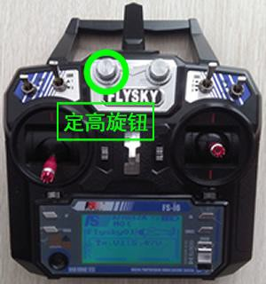{width="1.6557316272965878in" height="1.7666655730533682in"}

1）、遥控器定高模式：

> 气压计、超声波定高
>
> 定高模式，默认定义在遥控器的 VRA 旋钮上，当然也可以把定高模式映射到其它开 关上，比如设置到 SWB 开关上（请参看遥控器设置，这里不做描述），VRA 旋钮顺时 针转，分别为：低、中、高三个挡位，低档位是无定高模式，中档位是气压计定高 模式，高档位是超声波定高模式。

注意：起飞前，要将 VRA 旋钮，拨动到低档位\-\--无定高。推油门，飞到指定高度后， 顺时针旋转 VRA 旋钮，拨动到中档位\-\--气压计定高，高档位\-\--超声波定高。

> 参数值在 1000\-\--1299 之间是低档位；参数值在 1300\-\--1699 之间是中档位；参数
>
> 值在 1700\-\--2000 之间是高档位；

2）、一定要在无定高模式下起飞，达到预定高度后，再拨动 VRA 旋钮定高。如果起飞前 就定高，永远也飞不起来。

也就是：起飞前将 VRA 旋钮拨动到低档位，飞起来后，再拨动到中档位或者高档位。 3）、在 1.5 米以下是超声波定高，超过 1.5 米后，自动切换到气压计定高模式。

4）、气压计定高不是很稳定，容易受阳光，气流变化干扰，在气压计上面加盖一块黑色 海绵，会好很多。

5）、起飞前，要校准气压计，在校准加速度计和陀螺仪时，就同时校准了气压计。

3、飞行提示：

1）、由于超声波模块固有缺陷，高于 0.7 米后，噪声大大增加，所以超声波定高模式要

> 在 1.5 米以下。超过此高度，导致定高不稳。理论最大测距 2 米，超过这个高度， 需要切换到气压计定高。后续版本软件自动切换到气压计定高了。
>
> US100 超声波模块，带温度补偿，但在零下等低温环境下测量不准（有时连续测得 数据是 0），导致飞行不稳，这是超声波固有缺陷，不是飞控程序有问题，参考使用 吧，虽然有缺陷，毕竟没有更适合的测高模块可用。

2）、GPS 模块初次使用时，模块要校准时间并搜星，整个过程需要 10 分钟左右，时间 越长搜星数量越多，整机上电后等着，直到黄灯亮起来，GPS 就有信号了。下次使 用，不需要长时间等待，上电 20 秒左右黄灯就亮了。 注意：稳定版不支持定点悬停和自动返回功能，虽然黄灯也亮，GPS 模块也仅给出 地理坐标，在手机上显示地理坐标，但没有定点悬停功能。

3）、有些接收机上电就给飞控发信号，也不管遥控器是否开机，此时上电后用遥控器解 锁没问题。如果用手机解锁，要注意油门拉到最低位，再对飞控解锁，否则，解锁 后电机立马转动，这很危险。

> 新版富斯 FS-i6 遥控器，解决了这个问题，遥控器关机时，即使接收机上电，也不 发送信号，但只要遥控机开机，立刻启动接收机发信号，遥控器再次关机。接收机 启动保护模式，仍然给飞控发送预先设置信号。

4）、手机界面有回传的遥控器的控制量，如果发现参数偏离（比如：发现摇杆归中横滚 值是 1560，要微调到 1500），可以微调遥控器，请参考遥控器设置。

5）、遥控器的控制杆可以是非线性，也可以线性，修改油门控制来匹配最佳控制手感， 非定高模式必须手动控制油门，需要将油门设置在合适的折线，请参阅《模块资料： 遥控器块资料》部分。

4、定点悬停和自动返回功能：

> 稳定版不支持此功能，要定点悬停和自动返回功能，请参阅：LIGHT 国外开源程序固 件：移植德国 Autoquad 开源飞控程序，用下载器，将固件下载到飞控内，可实现定 点悬停和自动返回。在《固件下载》章节详细描述。
>
> 5、**指示灯状态**：
>
> 指示灯颜色顺序：蓝、红、绿、黄 蓝红绿灯为飞行模式指示灯，常亮是解锁状态。呼吸状态是加锁。 黄灯常亮，是收到 GPS 位置信号。黄灯闪烁，是故障指示状态。

#### 蓝 红 呼吸或常亮状态是气压定高模式 加锁、解锁状态 蓝 红 绿 呼吸或常亮状态是非定高模式 加锁、解锁状态

> **红 绿 呼吸或常亮状态是超声波定高模式 加锁、解锁状态 蓝 绿 呼吸状态是校准磁力计**
>
> 五、补充说明： 1）、稳定版**六旋翼、八旋翼、共轴八旋翼的代码支持：**
>
> 需要修改源代码，参见《从这里开始 5：开发平台、编译下载、多旋翼支持》章节， 有详细讲解。

2）、**定点悬停，自动返回。**如果想玩更高精度的控制和更多功能，穿越机（带摄像机， 精准控制），更复杂的队列控制，建议熟悉稳定版控制以后，再玩这个功能。 要下载固件，在后面章节有讲述，就是定点悬停，自动返回。

3）、LIGHT 国外开源程序固件：移植的德国 Autoquad 开源飞控程序，最后更新于 2017 年 8 月 28 日，针对 UKF(无迹卡尔曼)算法研究。仅姿态算法替换原有 LIGHT 程序， 其余完全一致。

资料 1：这是一款日本飞控移植而来，固件下载到 LIGHT 飞控内，配合日本的飞控地面 站使用。移植日本的 OpenPilot 开源飞控程序，最后更新于 2016 年 6 月底。支持 OpenPilot 地面站、SANYE-LibrePilot 地面站。基于 CC3D，适合于穿越机。

资料 2：这是一款德国飞控移植而来，移植的德国 Taulabs 开源飞控程序，最后更新于 2015 年 12 月底。支持 Taulabs 地面站。用于针对自动参数调整的算法学习。

#### 注意：不同固件 的使用方法和 地面站 完全不同且差异较大，认真看下载方法和使 用说明，不可掉以轻心！

> **资料 2 和 3 要谨慎使用，不适合初学者！ 疑难问题解答：**

请参阅疑难问题解答篇，是常见问题解答方法，是初学者最容易犯的错误，初学者必须

在后面章节。一定要看哦！不然会走弯路的！

关于蓝牙模块与手机或电脑的联机方法，后面章节有讲述。

关于 USB 转 TTL 线的 win10 驱动程序安装方法，在后面章节有讲解。 关于下载器的安装方法，后面章节有讲解。 关于开发环境的安装，后面章节，有专门讲述。

关于用 Keil5 开发环境的问题，在技术交流群里，有资料包，可下载安装。

# 飞控与电脑联机

一、飞控与 Windows 电脑联机方式： 1、电脑地面站软件安装：

> 联机之前，首先要安装软件，在光盘里找到软件，下图所示：
>
> {width="2.7588123359580052in" height="1.9375in"}
>
> 手机版 电脑版

安装："Light-Assistant(Windows 地面站)-1.0.7.exe",电脑版安装完成后，如下图 所示：

> {width="5.396357174103237in" height="3.3125in"}

2、飞控与电脑联机：

> 可以用蓝牙连接，也可以用 USB 转 TTL 线方式连接。

1）、如果电脑蓝牙联机，首先搜索蓝牙设备，找到飞控的蓝牙设备后，再配对，输入 配对码：1234，记下分配的端口号，而后，可以联机了，方法与手机类似。

> 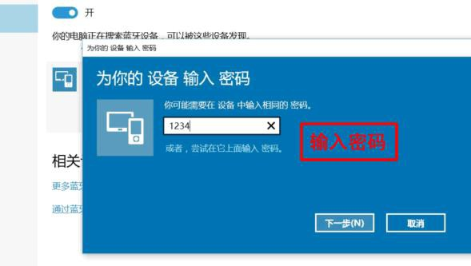{width="5.828751093613298in" height="3.2953116797900264in"}
>
> 接下来，设置蓝牙设备的属性，如下图所示：
>
> 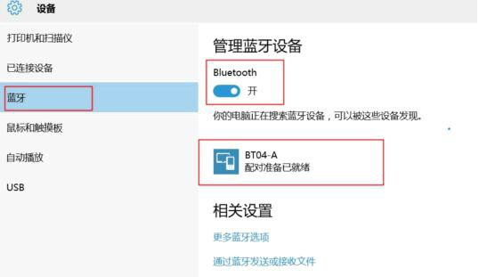{width="5.549441163604549in" height="3.2071872265966754in"}
>
> 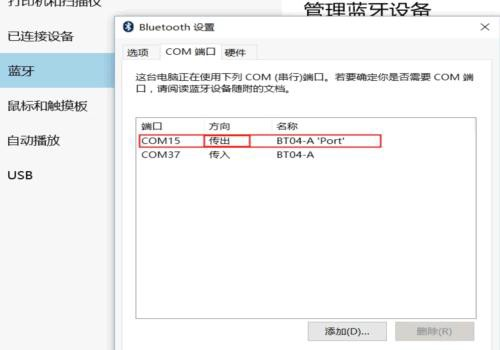{width="5.209523184601925in" height="3.6458333333333335in"}
>
> 上图，蓝牙设备端口是 COM15。通讯口要选 COM15，波特率 38400，点击图标按钮联机。
>
> {width="5.396357174103237in" height="3.3125in"}

2）、用 USB 转 TTL 联机：

> 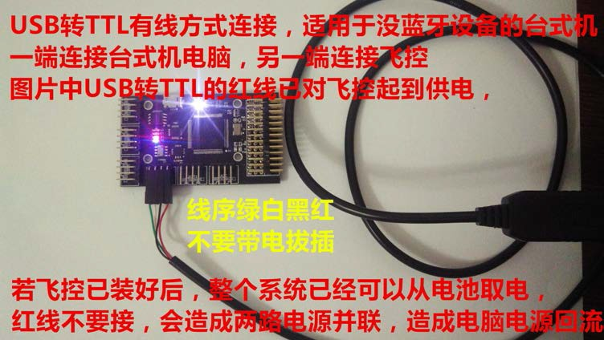{width="5.013752187226597in" height="2.8266666666666667in"}

查看设备管理器，检查驱动程序：

> 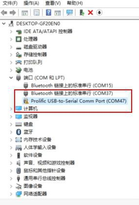{width="3.086013779527559in" height="4.55in"}
>
> 在资料：模块资料：USB-TTL 文件夹找到驱动程序。安装好即可。
>
> 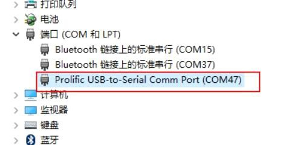{width="5.318501749781277in" height="2.8249989063867016in"}

#### 3、疑难问题解答：

如果用 win10 系统，这个 USB 转 TTL 线的驱动程序，win10 系统可能不认，这时， 查看设备管理器，程序上，有黄色的感叹号！说明驱动程序错误。

1）删掉 USB 转 TTL 线驱动程序，重新安装。如果还不行，再删掉。

2）用 win10 系统自带的兼容驱动程序，重新安装。不行再删掉，装下一个，多试几个， 在 win10 系统内，一定能找到，正确的驱动程序。

# 开发环境、程序下载、多旋翼支持

#### 一、搭建开发环境：

笔者用的代码编辑器是 Code::Blocks 的插件 emIDE，而 Code::Blocks 是号称史上 最强的集成开发环境，支持插件和跨平台，同时软件完全免费，对于追求完美的 C++ 程序员，再也不必忍受 Eclipse 的缓慢，再也不必忍受其他编译器高昂的价格。

提示：如果用期望用 Keil5 开发环境，请到技术交流群，共享文件夹里下载资料包， 有完整的文件资料，这里不讲述。

1、安装编译及开发软件：

这个 emIDE 是绿色版本。找到这个文件，解压缩在英文目录下，运行后这个目录就 作为 emIDE 的 PATH 路径了，如果想换目录，需删除并到新地址重新解压缩。

> {width="1.3290715223097114in" height="1.383957786526684in"} {width="1.349673009623797in" height="1.4343744531933509in"} {width="1.1914052930883638in" height="1.5843744531933508in"}

在光盘内，找到 emIDE 软件的 7z 压缩包，将其解压并运行 emIDE.exe，第一次打开 时，软件提示选择编译环境，如下图所示：

> {width="5.613545494313211in" height="3.5858333333333334in"}

2、源代码压缩包，解压后如下图所示:

> {width="5.426666666666667in" height="1.0833333333333333in"}

3、点击：打开一个已有工程，选择打开 LightControl.emp 工程文件。

> {width="4.3116666666666665in" height="1.3333333333333333in"}

4、打开工程文件之后，emide 界面如下： 在这里，可对源代码编辑、修改、编译，并下载程序。

> {width="6.007285651793526in" height="1.7416655730533683in"}

# 二、下载程序：

1、请先安装下载器 JLink 驱动程序,双击下面这个图标，自动安装完毕。 驱动程序安装好后，再将下载器插到电脑的 USB 口上，就可以用下载器下载固件了。

> {width="1.2416666666666667in" height="1.5999989063867017in"} {width="1.1009033245844269in" height="1.3016666666666667in"}

2、下载器与飞控连线：

> 飞控上的 3.3V SWCLK GND SWDIO ，分别连接下载器的 3V3 SWCLK GND SWDIO 注意连接线序不能有任何错误。
>
> {width="5.02675634295713in" height="2.0959372265966754in"}
>
> {width="2.9499529746281716in" height="3.4908333333333332in"}
>
> {width="3.919786745406824in" height="2.0933333333333333in"}

3、下载程序：

1）、如果是首次安装下载器驱动，需要启动 emIDE 软件，连接好下载器后，之后，点 击**下载调试按钮**（三角形图标，没编译的话，会自动编译),编译后的代码就下载 到飞控中了，并进入到调试状态。重新上电，飞控就开始运行刚刚下载的程序了。

2）、下载以后 再次点击**下载调试按钮（**三角形图标），程序开始运行（再次重新上 电也是同样效果）；就是，一闪完事，很快就结束，这是保护单片机，不要重复下 载同样内容，毕竟单片机下载次数是有限的，到一定次数后，单片机就坏了。

> 3）、下载以后 再次点击**退出调试按钮（方框叉**图标），退出调试下载。
>
> {width="5.991666666666666in" height="2.566666666666667in"}

4、如果下载有问题可修改下载速度：

> 在 emIDE 界面下，点击 **Project** 按钮，进入 **Propertis\...**修改速度。
>
> {width="5.135in" height="0.25in"}

下图是修改速度窗口： 尝试将 4000kHz 改成 300kHz

> {width="6.45589457567804in" height="1.92in"}

5、温馨提示： 这个编译器有个特点，下载程序时，如果第一次下载成功后，不会重复下载第二次， 当再次点击下载时，编译器闪动一下，但没有下载进度条提示，直接进入调试状态， 设计本意是减少 Flash 重复刷新，Flash 反复刷新，会缩短使用寿命。只有改动代 码并编译后，才可以再次下载。

更换另一个代码，点击箭头按钮，会有下载进度条。

6、下载失败及解决方法：

1）、没有安装提供的 JLink 驱动（有些软件自带但是不全面）， 请重新删除并安装资料提供的 JLink 驱动，重启一下 emIDE 软件。

2）、emIDE 没有正确配置编译环境。（第一次打开时，软件提示选择编译环境）。 请删除并重新解压 emIDE，选择编译环境。 3）、接线方式错误。请比照图片检查连线。

# 三、多旋翼支持：

> {width="6.015252624671916in" height="3.155624453193351in"}
>
> 正前方偏右的电机是 1 号，逆时针顺序依次是 2，3，4.........
>
> 默认是四旋翼 X 模式，需要修改不同机架 请在代码 ctrl.c 文件中修改 OP_COPTER 变量： CCW 是从上方向下看逆时针旋转，CW 与 CCW 刚好相反：
>
> 四旋翼：
>
> 六旋翼：

CW2 1CCW

\\ /

/ \\

CCW3 4CW

CW2 1CCW

\\ /

\\ /

CCW3------ ------ ------6CW

/ \\

/ \\

CW4 5CCW

> 八旋翼：

CW1 0CCW

\\ /

CCW2 \\ / 7CW

------ ------

CW3 / \\ 6CCW

/ \\

CCW4 5CW

> 共轴八旋翼：（双层桨叶）
>
> 注意：1,2,3,4 上层;5,6,7,8 下层,注意电机旋转顺序,
>
> CCW 和 CW 仍然是从正上空方参照向下看的,不是以电机为参照的。

CCW6 CW2 1CCW 5CW

\\ /

/ \\

CW7 CCW3 4CW 8CCW

# 开发环境、程序下载、多旋翼支持

#### 一、搭建开发环境：

笔者用的代码编辑器是 Code::Blocks 的插件 emIDE，而 Code::Blocks 是号称史上 最强的集成开发环境，支持插件和跨平台，同时软件完全免费，对于追求完美的 C++ 程序员，再也不必忍受 Eclipse 的缓慢，再也不必忍受其他编译器高昂的价格。

提示：如果用期望用 Keil5 开发环境，请到技术交流群，共享文件夹里下载资料包， 有完整的 Keil5 文件资料，这里不讲述。

1、安装编译及开发软件：

这个 emIDE 是绿色版本。找到这个文件，解压缩在英文目录下，运行后这个目录就 作为 emIDE 的 PATH 路径了，如果想换目录，需删除并到新地址重新解压缩。

> {width="1.3290715223097114in" height="1.383957786526684in"} {width="1.349673009623797in" height="1.4343744531933509in"} {width="1.1914052930883638in" height="1.5843744531933508in"}

在光盘内，找到 emIDE 软件的 7z 压缩包，将其解压并运行 emIDE.exe，第一次打开 时，软件提示选择编译环境，如下图所示：

> {width="5.613545494313211in" height="3.5858333333333334in"}

2、源代码压缩包，解压后如下图所示:

> {width="5.426666666666667in" height="1.0833333333333333in"}

3、点击：打开一个已有工程，选择打开 LightControl.emp 工程文件。

> {width="4.3116666666666665in" height="1.3333333333333333in"}

4、打开工程文件之后，emide 界面如下： 在这里，可对源代码编辑、修改、编译，并下载程序。

> {width="6.007285651793526in" height="1.7416655730533683in"}

# 二、下载程序：

1、 不插下载器，先安装下载器 JLink 驱动程序,双击下面这个图标，自动安装完毕。 驱动程序安装好后，再将下载器插到电脑的 USB 口上，就可以用下载器下载固件了。

> {width="1.2416666666666667in" height="1.5999989063867017in"} {width="1.1009033245844269in" height="1.3016666666666667in"}

2、下载器与飞控连线：

> 飞控上的 3.3V SWCLK GND SWDIO ，分别连接下载器的 3V3 SWCLK GND SWDIO 注意连接线序不能有任何错误。
>
> {width="5.02675634295713in" height="2.0959372265966754in"}
>
> {width="2.9499529746281716in" height="3.4908333333333332in"}
>
> {width="3.919786745406824in" height="2.0933333333333333in"}

3、下载程序：

1）、如果是首次安装下载器驱动，需要启动 emIDE 软件，连接好下载器后，之后，点 击**下载调试按钮**（三角形图标，没编译的话，会自动编译),编译后的代码就下载 到飞控中了，并进入到调试状态。重新上电，飞控就开始运行刚刚下载的程序了。

2）、下载以后 再次点击**下载调试按钮（**三角形图标），程序开始运行（再次重新上 电也是同样效果）；就是，一闪完事，很快就结束，这是保护单片机，不要重复下 载同样内容，毕竟单片机下载次数是有限的，到一定次数后，单片机就坏了。

> 3）、下载以后 再次点击**退出调试按钮（方框叉**图标），退出调试下载。
>
> {width="5.9916655730533686in" height="2.566666666666667in"}

4、如果下载有问题可修改下载速度：

> 在 emIDE 界面下，点击 **Project** 按钮，进入 **Propertis\...**修改速度。
>
> {width="5.135in" height="0.25in"}

下图是修改速度窗口： 尝试将 4000kHz 改成 300kHz

> {width="6.45589457567804in" height="1.92in"}

5、温馨提示： 这个编译器有个特点，下载程序时，如果下载成功后，不会再次重复下载，如果再 次点击下载，下载进度条窗口一闪而过，关闭进度条窗口，没有进度条提示，直接 进入调试状态，设计本意是减少 Flash 重复刷新，Flash 反复刷新，会缩短使用寿 命。只有改动代码并编译后，才可以再次下载。 如果换另一套代码，点击箭头按钮下载，会有下载进度条。

6、下载失败及解决方法：

1）、没安装 JLink 驱动程序，资料包里有驱动程序。 请删除并重新安装 JLink 驱动程序，重启一下 emIDE 软件。

2）、emIDE 没有正确配置编译环境。第一次打开时，软件提示选择编译环境。 请删除并重新解压 emIDE，选择好编译环境。 3）、下载器连线错误。插头反插，极易烧坏 STM32 的下载口，请比照图片正确连线。

# 三、多旋翼支持：

> {width="6.015252624671916in" height="3.155624453193351in"}

前方偏右是 1 号电机，逆时针，依次是 2，3，4.........，默认是四旋翼 X 型机架， 如果用 6 旋翼、8 旋翼或共轴 8 旋翼，需要修改代码 ctrl.c 文件中的 **OP_COPTER** 变 量，修改后，再编译下载。

下图标示：CCW 是逆时针旋转，CW 是顺时针旋转。 四旋翼：

> 六旋翼：

CW2 1CCW

\\ /

/ \\

CCW3 4CW

CW2 1CCW

\\ /

\\ /

CCW3------ ------ ------6CW

/ \\

/ \\

CW4 5CCW

八旋翼：

CW1 0CCW

\\ /

CCW2 \\ / 7CW

------ ------

CW3 / \\ 6CCW

/ \\

CCW4 5CW

共轴八旋翼：

就是双层桨叶，每层 4 只，注意：1、2、3、4 轴在上层，5、6、7、8 轴在下层, 要注意旋转顺序。

CCW6 CW2 1CCW 5CW

\\ /

/ \\

CW7 CCW3 4CW 8CCW

# 固件下载说明：

**一、固件说明：** 固件是:已经编译完的二进制代码文件，是固定的，不能修改的文件，简称固件。 LIGHT 飞控，为用户准备了 3 款固件，供用户体验。

1、LIGHT 飞控提供 4 款机型固件：重点标识的是四旋翼固件。

> {width="4.755787401574803in" height="0.9178116797900262in"}

以上 4 款固件，要加装 GPS 模块，支持定点悬停，自动返回功能。GPS 模块要在室外 空旷地，室内没有信号，GPS 仅提供地理坐标值。

2、LIGHT-OpenPilots 固件，这是一款日本飞控移植而来，固件下载到 LIGHT 飞控内， 要配合日本的地面站使用。没有制作教程，要谨慎使用，不适合初学者哦。

> {width="4.960906605424322in" height="2.0315616797900264in"}

3、LIGHT-Taulab 固件，是一款德国飞控移植而来，固件下载到 LIGHT 飞控内,配合德国 地面站使用。功能都很强大，没有制作教程，要谨慎使用，不适合初学者哦。

> {width="4.960906605424322in" height="2.0315616797900264in"}

提示：飞控固件更新后，必须恢复默认参数，恢复默认参数的方法前面已经介绍，可以 用手机，也可以用电脑恢复。

# 二、连接下载器：

1、下载固件之前，首先要装好下载器驱动程序，关于下载器驱动程序的安装方法， 前面章节有详细介绍，双击下面这个图标，自动安装完成。 再将下载器一端连到飞控的 SWD 下载口；另一端，插到电脑 USB 口上，就能下载 固件了。

如下图所示：

连线方法如下：

> {width="3.4466710411198602in" height="2.583957786526684in"}

2、打开 J-Flash，选择 Start J-Flash；或者进入后选择 File-\>new project；

> {width="2.4253258967629048in" height="1.1356244531933508in"}
>
> {width="4.738332239720035in" height="3.0833333333333335in"}

3、按键盘 Alt+F7 键，（1）切换到 SWD 模式，Jlink 需要限速，下载器设置自动速度；

（2）选择 CPU 的 Device 为 STM32FVG；其余均默认。

> {width="4.006258748906387in" height="2.008124453193351in"}
>
> {width="4.524576771653543in" height="2.7025in"}
>
> 

4、找到要下载的固件：

按 Ctrl+O 打开固件的 bin 格式文件。或点击 File 按钮，再点击 Open data file 条， 如下图所示：

> {width="4.061665573053368in" height="3.0in"}
>
> {width="5.137438757655293in" height="3.9579166666666667in"}

5、菜单项选择 Targer-\>Connect，准备下载到飞控内。

> {width="3.2454155730533683in" height="3.7059372265966752in"}
>
> 到这里，固件下载就完成了。

### 三、注意事项：

1）、注意刷写固件后，要恢复默认参数，可以看到新的 PID 参数。

2）、每次使用，最好校准陀螺仪传感器，校准传感器的同时会自动校准气压计。

3）、每次上电时航向不要指向正南方向，最好指向正北方向（以便于自检）。如果 发生自旋，立刻停止，并重新校准。

4）、辅助通道 1（AUX1 第 5 通道）:

> 映射到 VRA 旋钮上，是超声波定高和气压计定高。低档位（1000-1299）是空挡， 中档位（1300-1699）是超声波定高，高档位（1700-2000）是气压计定高。
>
> 1.5 米以下用超声波定高，超过 1.5 米，用气压计定高。

也可以将 AUX1 设置到 SWB 开关上（3 挡开关），参看遥控器设置视频。

5）、辅助通道 2（AUX2 第 6 通道）:

> 映射到 VRB 旋钮上，是定点悬停和自动返回。低档位（1000-1299）是定点悬停， 中档位（1300-1699）是空挡，高档位（1700-2000）是自动返回。 自动返回，总是返回到上一个悬停点，所以，用这个功能之前，要先悬停一次。 也可以将 AUX2 设置到 SWC 开关上（3 挡开关），参看遥控器设置视频。

提示：

抵挡位参数值：1000-1299，中档位参数值：1300-1699，高档参数值：1700-2000

#### 四．介绍下定点悬停，自动返回：

如果 light 飞控下载了，上面介绍的 4 款机型固件，重点是四旋翼固件，

LIGHT-Autoquad-quad(四旋翼).bin。并且装有 GPS 模块支持，可实现定点悬停和 自动返回功能。

> {width="1.7296041119860017in" height="1.8229166666666667in"}

定点悬停和自动返回，被定义在 VRB 旋钮上，如上图所示，VRB 旋钮分为 3 个档位， 顺时针转动，分别是：低档位、中档位、高档位。

提示：低档位参数值在 1000\-\--1299 之间；中档位参数值在 1300\-\--1699 之间；高

> 档位参数值在 1700\-\--2000 之间；

遥控器还可以将辅助 AUX2 通道，映射到其他开关上，参看遥控器说明。

1、起飞时，将 VRB 拨到中档位\-\--空挡，当飞到预定位置后，将 VRB 拨到低档位\-\-- 定点悬停档，开始定点悬停，悬停时，空气流动，对悬停影响很大，飞机会在悬 停点位来回飘动，这是正常现象，并不是定死，这是因为民用 GPS 信号，精度不 高，大约 2 米范围，飞控还要用加速度计，计算漂移量，努力将飞机控制在一个 点位上。

2、在悬停点位，可操控飞机前后左右飞行，当松开遥控器摇杆，飞机自动回到悬停 点位置。

3、取消悬停，将 VRB 拨到中档位\-\--空挡位，飞到其他位置，再将 VRB 拨到高档位

\-\--自动返回挡，会回到上次悬停的位置，这就是自动返回。

4、手机控制，也能实现，定点悬停和自动返回功能，与遥控器一样，自己可试试， 这里不作介绍了。 需要注意的是，手机遥控，初学者，要先熟练遥控器控制，再考虑手机控制。

# 调参、参数的意义

> **一、调整参数：**

1、飞控上电后，要加载参数，参数存放在片外存储器内，可以通过手机或电脑调整， 掉电保存，且不随烧写不同版本的程序而改变。所以参数必须手动调整，或者恢 复默认方式调整。

> {width="3.124316491688539in" height="1.90625in"}

2、**参数的重要性：** 参数是开发人员必须掌握的重要数据。合理的配置这些参数，使动力分配合理， 飞行更加流畅，LIGHT 飞控出厂前已配置好参数，适合四旋翼飞机，用户可根据 自己需要，调整参数，找到最适合自己的参数值。并将自己的参数，写入程序， 设计自己的飞机。 注意:不同版本的程序,参数有所不同，下载完程序后，要恢复默认参数。

> {width="1.9952384076990377in" height="2.91125in"}

#### 飞控重新下载不同版本的程序后，如果不确定参数，请必须恢复默认参数，可以 用手机调参，也可以用电脑调参，效果完全一样。

> **3、恢复默认参数：** 通俗一点讲，恢复默认参数，就是恢复出厂设置。
>
> 用手机恢复，点击"恢复默认"，用电脑恢复，点击"重置"，可将原程序里的参数
>
> 表，保存到片外存储器里，默认参数，就恢复完成了。手机点击"读出参数"，或 者电脑点击"读出全部"，可查看回复后的参数表。 如果调参，就在这里修改，然后，点击写入，就将参数存到片外存储器了。 **注释：** 飞行控制时，读取的是片外存储器的参数值。并不是程序内的参数表。这为调参 带来极大方便。不能因为调一下参数，就烧一次程序吧，毕竟单片机的烧写次数 是有限的。
>
> **在源代码的 driver_parameter.c 中，**一共 10 组，每组 3 项。
>
> **4、下面是 2017 年 8 月 28 日源代码默认参数表：** 请参考使用。
>
> {width="5.994041994750656in" height="2.09625in"}
>
> **重置**就是恢复默认参数，手机上称作：**恢复默认**。通俗一点讲就是恢复出厂设置。 用手机调参和用电脑调参，效果完全一样，修改后，点击**写入**，掉电保存。

# 二．参数的意义及调整：

> 了解参数的意义，对开发人员非常重要。调参时，要少量修改，慢慢调试。
>
> 参数分 3 大类：第一组是速率参数，第二组是姿态参数，第 3 组是高度参数。每个 参数又分为 P,I,D 三挡，如下图所示。
>
> ROL 横滚动作，PIT 是俯仰动作，YAW 是偏航动作（航向）。

#### 1、第一组速率参数：

> {width="3.488332239720035in" height="1.2916666666666667in"}
>
> **2、第二组是姿态稳定参数：**
>
> {width="3.4657174103237094in" height="1.1041666666666667in"}
>
> **3、第 3 组是高度参数：**

4、手机调参窗口：与电脑调参效果相同。下图是 2017 年 8 月 28 日程序参数表

> {width="3.578066491688539in" height="8.507811679790025in"}
>
> {width="3.5928062117235346in" height="4.266666666666667in"}
>
> **5、PID 的意义：** 闭环控制系统依赖反馈，包括：测量、比较和执行，测量值与期望值比较，得

到差值，用差值来调节控制系统。工程实际中，应用最广泛的是：比例控制、积 分控制、微分控制，简称 PID 控制器，又称 PID 调节器。

PID 控制器（比例、积分、微分）是工业控制应用中，常见的反馈控制部件， 由 P 比例单元、I 积分单元、D 微分单元组成。PID 控制的基础是比例控制；积分 控制可消除稳态误差，但可增加超调；微分控制可加快系统的响应速度，以及减 弱超调趋势。

PID 就是：比例（Proportion）、积分（Integral）、导数（Derivative），PID 控制器广泛应用于工业控制，简单易懂，不需建立精确的数学模型。

6、关于调参的更详细讲解，在下面文件夹里有详细介绍： 在这个文档里，有调参的一些实践经验，套餐方法，有非常详细的描述，可阅读

参考一下。

> {width="6.030084208223972in" height="1.7775in"}
>
> {width="5.342319553805774in" height="2.1979166666666665in"}

#### 一、飞控硬件资源：

> **程序架构及算法详解**

微处理器：STM32F407VGT6；6 轴加速度计与陀螺仪：MPU6050；3 轴地磁传感器： AK8975；高精度气压传感器：MS5611；Flash 存储器：25Q32FVSIG。

主控芯片用带有 ARM Cortex-M4 内核的 STM32F407VGT6，其 168 MHz 的主频和丰 富的接口，保证了系统运算的实时性。将传感器数据采集后，经过简单的预处理去 掉毛刺后，由加速度计、磁罗盘计算姿态角，通过卡尔曼滤波融合陀螺仪数据，得 到较为精确的姿态角。

其中卡尔曼滤波器主要包括两个过程：预估和校正。预估过程是利用时间更新方 程建立对当前状态的先验估计，及时向前推算出当前状态变量和误差协方差估计的 值，以便为下一个时间状态构造先验估计值 。校正过程则相当于反馈，利用测量值 来得到校正状态，建立对当前状态的改进的后验估计。

通信接口为带中继的蓝牙串口模块，可以实现远程数据传输，可使用任何蓝牙主 设备与其进行配对连接，然后按照协议发送控制指令。考虑很多初学者刚接触遥控 器，我们开发飞控时采取手机控制方式，因为手机本身内置很多传感器，于是在设 计上直接通过解算手机本身的横滚、俯仰姿态，来控制飞机的横滚、俯仰姿态。通 过手机内置的地磁传感器，解算手机的指向，来实现对飞机航向的控制。飞行高度 用飞控本身的气压传感器或超声波测距传感器，再结合加速度计垂直地面的方向数 值，来实现自动控制高度，当需要提升高度或者降低高度时通过手机控制，不需要 人为控制油门来保持高度不变，从而实现智能化控制。当然飞控本身支持 8 通道遥 控器对其控制。

设计初衷是用于适合新手学习飞行姿态解算，更适合玩家做多种拓展和二次开 发，Light 飞控本身硬件资源冗余度高，有足够多的资源用于二次开发。

> 同时算法精简，占用微处理器资源小，控制频率为 500Hz，稳定可靠。

Light 飞控预留 4 个 UART,1 个 IIC 串口，可外接各种设备：已经支持 2.4G 高 速数传 470Mhz 大功率远程超程遥控与数传；GPS 位置信息。

#### 二、代码编辑与下载：

笔者用的代码编辑器是 Code::Blocks 的插件 emIDE，Code::Blocks 是号称史上最 强的集成开发环境，支持插件和跨平台，同时软件完全免费，对于追求完美的 C++ 程序员，再也不必忍受 Eclipse 的缓慢，再也不必忍受 VS.NET 的庞大和高昂的价格。

# 三、代码程序概述：

飞控本身作为一个系统，有多个任务轮流执行，每个任务执行周期不同。 程序为先初始化然后进入主循环。初始化过程如下：

> /\*\-\-\-\-\-\-\-\-\-\-\-\-\-\-\-\-\-\-\-\-\-\-\-\-\-\-\-\-\-\-\-\-\-\-\-\-\-\-\-\-\-\-\-\-\-\-\-\-\-\-\-\-\-\-\-\-\--
>
> \+ 实现功能：飞控初始化
>
> \-\-\-\-\-\-\-\-\-\-\-\-\-\-\-\-\-\-\-\-\-\-\-\-\-\-\-\-\-\-\-\-\-\-\-\-\-\-\-\-\-\-\-\-\-\-\-\-\-\-\-\-\-\-\-\-\--\*/
>
> void Light_Init()
>
> {
>
> /\* 中断优先级组别设置 \*/ NVIC_PriorityGroupConfig(NVIC_PriorityGroup_3);
>
> /\* 开启定时器 \*/
>
> SysTick_Configuration();
>
> /\* LED 功能初始化 \*/ LED_Init();
>
> /\* 接收机信号采集初始化 \*/ PWM_IN_Init();
>
> /\* 初始化信号输出功能 400HZ \*/
>
> PWM_Out_Init(400);
>
> /\* I2C 初始化 \*/ I2c_Device_Init();
>
> /\* 气压计初始化 \*/ MS5611_Init();
>
> /\* 加速度计、陀螺仪初始化，配置 20hz 低通 \*/
>
> MPU6050_Init(20);
>
> /\* 磁力计初始化 \*/
>
> hard_error_ak8975 = AK8975_IS_EXIST();
>
> /\* 数传初始化 \*/ Data_transfer_init();
>
> /\* 超声波初始化 \*/ Ultrasonic_Init();
>
> /\* GPS 模块初始化 \*/
>
> GPS_Init();
>
> /\* 参数初始化 \*/ Para_Init();
>
> /\* 时间统计初始化 \*/ Cycle_Time_Init();
>
> /\* 硬件故障指示 \*/
>
> if( hard_error_ak8975 ) LED_Mag_Err(); if( hard_error_mpu6050 ) LED_MPU_Err(); if( hard_error_ms5611 ) LED_MS5611_Err();
>
> /\* 初始化结束标识 \*/ Init_Finish = 1;
>
> }

1、无操作系统时间片轮方式下：

源代码中主函数（C 语言默认程序入口），有 2 行，分别为初始化和主循环。

> void main(void)
>
> {
>
> Light_Init(); while(1)Main_Loop();
>
> }

初始化后微控制器会开启定时器，每隔 1ms 产生中断如下：

> /\*\-\-\-\-\-\-\-\-\-\-\-\-\-\-\-\-\-\-\-\-\-\-\-\-\-\-\-\-\-\-\-\-\-\-\-\-\-\-\-\-\-\-\-\-\-\-\-\-\-\-\-\-\-\-\-\-\--
>
> \+ 实现功能：由 Systick 定时器调用 周期：1 毫秒
>
> \-\-\-\-\-\-\-\-\-\-\-\-\-\-\-\-\-\-\-\-\-\-\-\-\-\-\-\-\-\-\-\-\-\-\-\-\-\-\-\-\-\-\-\-\-\-\-\-\-\-\-\-\-\-\-\-\--\*/
>
> void Call_Loop_timer()
>
> {
>
> /\* 不同周期的执行任务独立计时 \*/ loop.cnt_2ms++;
>
> loop.cnt_5ms++;
>
> loop.cnt_10ms++; loop.cnt_20ms++; loop.cnt_50ms++; loop.cnt_100ms++;
>
> /\* 如果代码在预定周期内没有运行完 \*/ if( loop.check_flag == 1)
>
> /\* 错误次数计数 \*/ loop.err_flag ++;
>
> /\* 循环运行开始 标志置 1 \*/
>
> else loop.check_flag = 1;
>
> }

主循环过程如下：主循环有多个任务组成，主循环会等待由定时器产生中断的标志， 判断标志位来执行任务。

> /\*\-\-\-\-\-\-\-\-\-\-\-\-\-\-\-\-\-\-\-\-\-\-\-\-\-\-\-\-\-\-\-\-\-\-\-\-\-\-\-\-\-\-\-\-\-\-\-\-\-\-\-\-\-\-\-\-\--
>
> \+ 实现功能：主循环 由主函数调用
>
> \-\-\-\-\-\-\-\-\-\-\-\-\-\-\-\-\-\-\-\-\-\-\-\-\-\-\-\-\-\-\-\-\-\-\-\-\-\-\-\-\-\-\-\-\-\-\-\-\-\-\-\-\-\-\-\-\--\*/
>
> void Main_Loop()
>
> {
>
> /\* 循环周期为 1ms \*/
>
> if( loop.check_flag == 1 )
>
> {
>
> Duty_1ms(); //周期 1ms 的任务
>
> /\* 判断每个不同周期的执行任务执行条件 \*/ if( loop.cnt_2ms \>= 2 )
>
> {
>
> loop.cnt_2ms = 0;
>
> Duty_2ms(); //周期 2ms 的任务
>
> }
>
> if( loop.cnt_5ms \>= 5 )
>
> {
>
> loop.cnt_5ms = 0;
>
> Duty_5ms(); //周期 5ms 的任务
>
> }
>
> if( loop.cnt_10ms \>= 10 )
>
> {
>
> loop.cnt_10ms = 0;
>
> Duty_10ms(); //周期 10ms 的任务
>
> }
>
> if( loop.cnt_20ms \>= 20 )
>
> {
>
> loop.cnt_20ms = 0;
>
> Duty_20ms(); //周期 20ms 的任务
>
> }
>
> if( loop.cnt_50ms \>= 50 )
>
> {
>
> loop.cnt_50ms = 0;
>
> Duty_50ms(); //周期 50ms 的任务
>
> }
>
> if( loop.cnt_100ms \>= 100 )
>
> {
>
> loop.cnt_100ms = 0;
>
> Duty_100ms(); //周期 50ms 的任务
>
> }
>
> /\* 循环运行完毕 标志清零 \*/ loop.check_flag = 0;
>
> }
>
> }

四、分布讲解

> 飞行控制算法为多任务以不同时间间隔运行，所有任务如下： 主要任务为分为两个方面
>
> 1、姿态、速度、位置信息解算
>
> 2、PID 控制
>
> /\*\-\-\-\-\-\-\-\-\-\-\-\-\-\-\-\-\-\-\-\-\-\-\-\-\-\-\-\-\-\-\-\-\-\-\-\-\-\-\-\-\-\-\-\-\-\-\-\-\-\-\-\-\-\-\-\-\--
>
> \+ 实现功能：1ms 周期任务
>
> \-\-\-\-\-\-\-\-\-\-\-\-\-\-\-\-\-\-\-\-\-\-\-\-\-\-\-\-\-\-\-\-\-\-\-\-\-\-\-\-\-\-\-\-\-\-\-\-\-\-\-\-\-\-\-\-\--\*/
>
> void Duty_1ms()
>
> {
>
> /\* 调用渐变显示 \*/ Call_LED_show( LED_Brightness );
>
> /\* 调用数传通信 \*/ Call_Data_transfer();
>
> }
>
> /\*\-\-\-\-\-\-\-\-\-\-\-\-\-\-\-\-\-\-\-\-\-\-\-\-\-\-\-\-\-\-\-\-\-\-\-\-\-\-\-\-\-\-\-\-\-\-\-\-\-\-\-\-\-\-\-\-\--
>
> \+ 实现功能：2ms 周期任务
>
> \-\-\-\-\-\-\-\-\-\-\-\-\-\-\-\-\-\-\-\-\-\-\-\-\-\-\-\-\-\-\-\-\-\-\-\-\-\-\-\-\-\-\-\-\-\-\-\-\-\-\-\-\-\-\-\-\--\*/
>
> void Duty_2ms()
>
> {
>
> /\* 调用 0 号计时通道，用于计算两侧调用的时间间隔 \*/ float inner_loop_time = Call_timer_cycle(0);
>
> /\* mpu6 轴传感器数据处理 \*/ Call_MPU6050_Data_Prepare( inner_loop_time );
>
> /\* 内环角速度控制 \*/ CTRL_angular_velocity( inner_loop_time );
>
> /\* 遥控器通道数据处理 \*/ Call_RadioContrl( inner_loop_time );
>
> }
>
> /\*\-\-\-\-\-\-\-\-\-\-\-\-\-\-\-\-\-\-\-\-\-\-\-\-\-\-\-\-\-\-\-\-\-\-\-\-\-\-\-\-\-\-\-\-\-\-\-\-\-\-\-\-\-\-\-\-\--
>
> \+ 实现功能：5ms 周期任务
>
> \-\-\-\-\-\-\-\-\-\-\-\-\-\-\-\-\-\-\-\-\-\-\-\-\-\-\-\-\-\-\-\-\-\-\-\-\-\-\-\-\-\-\-\-\-\-\-\-\-\-\-\-\-\-\-\-\--\*/
>
> void Duty_5ms()
>
> {
>
> /\* 调用 1 号计时通道，用于计算两侧调用的时间间隔 \*/ float outer_loop_time = Call_timer_cycle(1);
>
> /\* IMU 更新姿态:ROL,PIT,YAW 姿态角 \*/ Call_IMUupdate(0.5f \*outer_loop_time);
>
> /\* 外环角度控制 \*/
>
> CTRL_attitude ( outer_loop_time );
>
> }
>
> /\*\-\-\-\-\-\-\-\-\-\-\-\-\-\-\-\-\-\-\-\-\-\-\-\-\-\-\-\-\-\-\-\-\-\-\-\-\-\-\-\-\-\-\-\-\-\-\-\-\-\-\-\-\-\-\-\-\--
>
> \+ 实现功能：10ms 周期任务
>
> \-\-\-\-\-\-\-\-\-\-\-\-\-\-\-\-\-\-\-\-\-\-\-\-\-\-\-\-\-\-\-\-\-\-\-\-\-\-\-\-\-\-\-\-\-\-\-\-\-\-\-\-\-\-\-\-\--\*/
>
> void Duty_10ms()
>
> {
>
> /\* 气压计数据处理 \*/
>
> if( MS5611_Update() ) baro_ctrl_start = 1;
>
> /\* 磁力计（电子罗盘）数据处理 \*/ Call_AK8975();
>
> }
>
> /\*\-\-\-\-\-\-\-\-\-\-\-\-\-\-\-\-\-\-\-\-\-\-\-\-\-\-\-\-\-\-\-\-\-\-\-\-\-\-\-\-\-\-\-\-\-\-\-\-\-\-\-\-\-\-\-\-\--
>
> \+ 实现功能：20ms 周期任务
>
> \-\-\-\-\-\-\-\-\-\-\-\-\-\-\-\-\-\-\-\-\-\-\-\-\-\-\-\-\-\-\-\-\-\-\-\-\-\-\-\-\-\-\-\-\-\-\-\-\-\-\-\-\-\-\-\-\--\*/
>
> void Duty_20ms()
>
> {
>
> /\* 保存参数 \*/ Parameter_Save();
>
> }
>
> /\*\-\-\-\-\-\-\-\-\-\-\-\-\-\-\-\-\-\-\-\-\-\-\-\-\-\-\-\-\-\-\-\-\-\-\-\-\-\-\-\-\-\-\-\-\-\-\-\-\-\-\-\-\-\-\-\-\--
>
> \+ 实现功能：50ms 周期任务
>
> \-\-\-\-\-\-\-\-\-\-\-\-\-\-\-\-\-\-\-\-\-\-\-\-\-\-\-\-\-\-\-\-\-\-\-\-\-\-\-\-\-\-\-\-\-\-\-\-\-\-\-\-\-\-\-\-\--\*/
>
> void Duty_50ms()
>
> {
>
> /\* 飞行模式检测及切换 \*/ Call_RadioControl_Mode();
>
> /\* 控制 LED 任务 \*/
>
> Call_LED_duty();
>
> }
>
> /\*\-\-\-\-\-\-\-\-\-\-\-\-\-\-\-\-\-\-\-\-\-\-\-\-\-\-\-\-\-\-\-\-\-\-\-\-\-\-\-\-\-\-\-\-\-\-\-\-\-\-\-\-\-\-\-\-\--
>
> \+ 实现功能：100ms 周期任务
>
> \-\-\-\-\-\-\-\-\-\-\-\-\-\-\-\-\-\-\-\-\-\-\-\-\-\-\-\-\-\-\-\-\-\-\-\-\-\-\-\-\-\-\-\-\-\-\-\-\-\-\-\-\-\-\-\-\--\*/
>
> void Duty_100ms()
>
> {
>
> /\* 调用 2 号计时通道，用于计算两侧调用的时间间隔 \*/ float position_loop_time=Call_timer_cycle(2);
>
> /\* 超声波模块 \*/ Call_Ultrasonic();
>
> /\* GPS 模块 \*/ Call_GPS();
>
> /\* 位置控制 \*/ PositionControl_Mode(position_loop_time);
>
> }

**五、PID 概述：** 在过程控制中，按[偏差](http://baike.baidu.com/view/692985.htm)的比例（P）、积分（I）和微分（D）进行控制的 PID 控制

器是应用最为广泛的一种自动控制器。 PID 位置算法的离散公式：

> {width="6.65969706911636in" height="0.37406167979002625in"}

u(t).......控制器的输出值。

e(t) ...\....控制器输入与设定值之间的误差。 Kp........比例系数

Ki.........积分系数 Kd........微分系数

PID 算法看起来虽然简单，但是要运用到控制系统中，并非易事，参数选择不恰 当的话，反而会适得其反。所以如何整定 PID 参数成为控制系统能否良好运行的关 键因素。

#### PID 含义：

很多人不懂 PID，可以理解为把两个毫不相关的事物通过比例微分积分的方式联系 在一起，

参数需要理解后调整。位置部分没有默认参数 比如：

PID1、2、3、4、5、6：每个轴独立 每个轴自稳

输入期望姿态 和当前姿态控制 输出 期望角速度控制量 每个轴速率

输入期望角速度控制量 和当前角速度 输出 作用于电机电调的控制量 PID7、8：

高度保持

输入期望高度位置 和当前高度位置 输出 期望高度速度控制量 高度速率

输入期望高度速度控制量 和当前高度速度 输出 作用于电机电调的控制量 PID9、10：

位置保持

输入期望位置控制量 和当前位置信息 输出 期望位置速度控制量 位置速率

输入期望位置速度控制量和当前位置速度信息 输出 期望姿态

> **PID 参数整定:**

\(1\) 比例系数 Kp 对系统性能的影响： 比例系数加大，使系统的动作灵敏，速度加快，稳态误差减小。Kp 偏大，振荡 次数加多，调节时间加长。Kp 太大时，系统会趋于不稳定。Kp 太小，又会使系 统的动作缓慢。Kp 可以选负数，这主要是由执行机构、传感器以控制对象的特 性决定的。如果 Kp 的符号选择不当对象状态(pv 值)就会离控制目标的状态(sv 值)越来越远，如果出现这样的情况 Kp 的符号就一定要取反。

\(2\) 积分控制 Ti 对系统性能的影响：

积分作用使系统的稳定性下降，Ti 小（积分作用强）会使系统不稳定，但能消 除稳态误差，提高系统的控制精度。

\(3\) 微分控制 Td 对系统性能的影响：

微分作用可以改善动态特性，Td 偏小时，超调量也较大，容易产生震荡，调节 时间也较长。Td 偏大时，超调量较大，调节时间较短。只有 Td 合适，才能使超 调量较小，减短调节时间。

# 疑难问题解决方法：

许多朋友，拿到配件后，非常兴奋，匆忙组装，没认真看使用说明，常常会出现许多问 题，现总结如下：

1、起飞为啥翻跟头呢？ 组装完毕后，匆忙试飞，推遥控器油门，准备起飞时，飞机刚要离开地面，就翻跟头， 总是飞不起来，原因是四个电机转动方向有错的，1、3 号电机（银白帽）要逆时针 转动，2、4 号电机（黑帽）要顺时针转动，请检查电机与电调的 3 根连线，是否焊 接错了；电调与飞控板的插头，是否插错了位置。每个电机都有固定位置。比如 1

号电机，不能装在 2 号电机的位置，否则就翻跟头。

2、起飞后，为啥总是向某个方向偏离呢？

1）、主要是组装导致，飞控模块一定要水平固定于机架上板正中心，用热熔胶牢牢 固定，不可松动，松动了必然偏飞。

2）、组装机架时，将机架放于水平桌面，刚开始，不要拧紧机架螺丝，等到所有螺 丝都装上去后，再统一拧紧螺丝，这样装好的机架水平，不会出现翘角，注意：所 有螺丝都要拧紧，不可松动，不缺螺丝。

3）、校准磁力计\-\--电子罗盘时，要远离强磁场，电脑也有磁场干扰。

4）、校准陀螺仪时，将飞机放到水平桌面上，或者水平地板上，绝对不可以倾斜哦。 要多点击几次校准按钮，姿态控制，主要依靠陀螺仪数据。 注意：如果电机下面绑有减震泡沫，一定要取下泡沫，待校准后，再绑上去，绝对

> 不须带着泡沫校准。否则，必然偏飞。

5）、恢复默认参数，这个步骤非常关键，很多人都没做，导致偏飞，用手机或电脑 都能恢复。目的是恢复程序里自带的参数，因每套程序，参数略有不同。飞控更换 新程序后，必须恢复一下参数。

3、为啥手机不能遥控飞机呢？ 遥控器控制，优先级高于手机，有了遥控器控制，手机只能显示数据，只有拔下遥控 接收机，手机才能遥控飞机。或者拔下遥控接收机某个通道连线，手机才能遥控这个 通道的控制。 提示：手机遥控飞机，很难操控，最好还是用遥控器。若用手机遥控飞机，必须加数 传模块，不可用蓝牙模块代替数传模块。蓝牙模块有效距离太近，会导致飞机失控， 眼看着飞机飞丢了。

4、有定点悬停功能吗？

室外玩定点悬停功能，飞控必须加装 GPS 模块，并且下载支持定点悬停的固件，烧 完固件后，要记住，恢复一下默认参数，下面是定点悬停固件：

> {width="4.164251968503937in" height="1.4375in"}
>
> {width="4.164609580052494in" height="1.6875in"}

这个固件的源代码，目前还没开源，要等等哦。

5、插上 GPS 模块了，也下载了定点悬停固件，飞控板黄灯为啥不亮呢？

初次使用 GPS 模块，它要校准时间和搜星，大约需要 10 分钟，直到飞控黄灯亮后， 就可正常使用了。下次使用时，大约 1 分钟左右，黄灯就亮了。

提示：室内没有 GPS 信号，必须在室外空旷地使用。

6、飞控能否在 keil5 下开发？

飞控采用 enIDE 开发平台,emIDE 是个绿色开发软件，安装简单，解开压缩包，立马就 能用。删除不留垃圾，并且完全免费，没有版权限制，keil5 是有版权的。如果在 keil5 下开发，需要移植源代码，我们也将移植方法提供给了大家，在技术交流群的共享文 件夹里，自己找一下吧，不要说没有，找不到哦，文件就放在那。

> {width="5.285439632545931in" height="1.9581244531933508in"}

7、电池为啥充不满电呢? 航模电池是动力电池，内阻很小，不同于一般锂电池，比较娇气，不能过放电，当电 压低于 11.1v 时，必须立刻充电，不能再继续用了，否则可能导致电池鼓包，或者永 远充不满电，造成电池永久性损坏。

提示：飞行时，电池一定要加上 BB 响，或者电压计模块，在我这里购买的遥控器， 都增配了电压计模块。航模电池，不同于普通锂电池，它内阻很小，短路电流非常大， 千万不要短路哦，一定要充满电后，才可以使用，当电压到 11.1V 时，必须停下来充 电，不能再继续飞行了，只要一次过放电，就可能导致电池报废。无数次教训了，关 于电池，说明里已经介绍的非常详细了。

一定要插上电压计，随时监控电池。

8、飞控下载了定点悬停固件，为啥不能用呢？

定高模式用遥控器的 VRA 旋钮，起飞前不能定高，只有起飞后，才能定高。也就是起 飞前，将 VRA 旋钮拨动到空挡\-\--低档位，逆时针旋到底，就是抵挡位\-\--空挡。起飞后，

拨动到中档位或高档位。

VRB 是定点悬停，起飞前拨到空挡\-\--中档位，飞到指定位置后，拨到低档位\-\--定点悬停， 拨到高档位\-\--自动返回。飞机自动返回到上一个悬停点，所以用这个功能时，一定要 先定点悬停一次。

9、数传模块补充

设置发射功率不要太大哦，设置成 14dBm 就够用了，太大了，对电源要求高，如果电 能跟不上，会导致操控飞行困难，发生莫名其妙的问题。

10、巡线功能：

必须要用到光流计\-\--摄像头，这部分代码，在摄像头部分有详细介绍，在开发者的文 件夹里，有部分源代码，这里没有，不做介绍。购买摄像头后，可下载我们的巡线源 代码。
